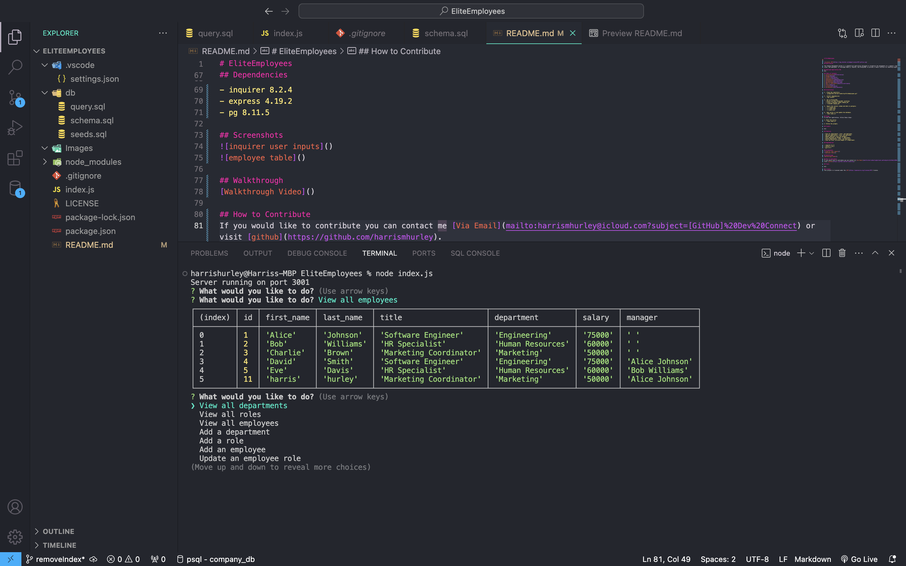

# EliteEmployees

    

## Description

The Company Management System is a command-line application designed to streamline the management of a company's departments, roles, and employees. It leverages Node.js, Express, and PostgreSQL to provide a robust solution for handling organizational data.

## Deployed Application URL
N/A

## Table of Contents
* [Installation](#installation)
* [Usage](#usage)
* [Credits](#credits)
* [Features](#features)
* [Dependencies](#dependencies)
* [Screenshots](#screenshots)
* [Walkthrough](#walkthrough)
* [How to Contribute](#how-to-contribute)
* [Tests](#tests)
* [License](#license)
* [Screenshots](#screenshots)

## Installation

1.  Clone the repository:
  - 'git@github.com:harrismhurley/EliteEmployees.git'

2.  Install dependencies:
  - 'npm install'

3.  Set up PostgreSQL:
  - Ensure you have PostgreSQL installed.
  - Create a database named company_db:
  - 'createdb company_db'

4.  Import the initial schema and data in postgres:
  - '\i schema.sql'
  - '\i seeds.html'
  - '\i query.sql'

5.  Open server.js and update the database.
  - 'node index.js'

## Usage
To use this application, follow these steps:

1. Start the server:
  - 'node index.js'

2. Follow the prompts.

## Credits

N/A

## Features

- View all departments, roles, and employees.
- Add new departments, roles, and employees.
- Update employee roles and managers.
- View employees by manager or department.
- Delete departments, roles, and employees.
- View the total utilized budget of a department.

## Dependencies

- inquirer 8.2.4
- express 4.19.2
- pg 8.11.5

## Screenshots

## Walkthrough
[Walkthrough Video]()

## How to Contribute
If you would like to contribute you can contact me [Via Email](mailto:harrismhurley@icloud.com?subject=[GitHub]%20Dev%20Connect) or visit [github](https://github.com/harrismhurley).

## Tests

N/A

## License 
This project is licensed under the [MIT](https://opensource.org/licenses/MIT) license.